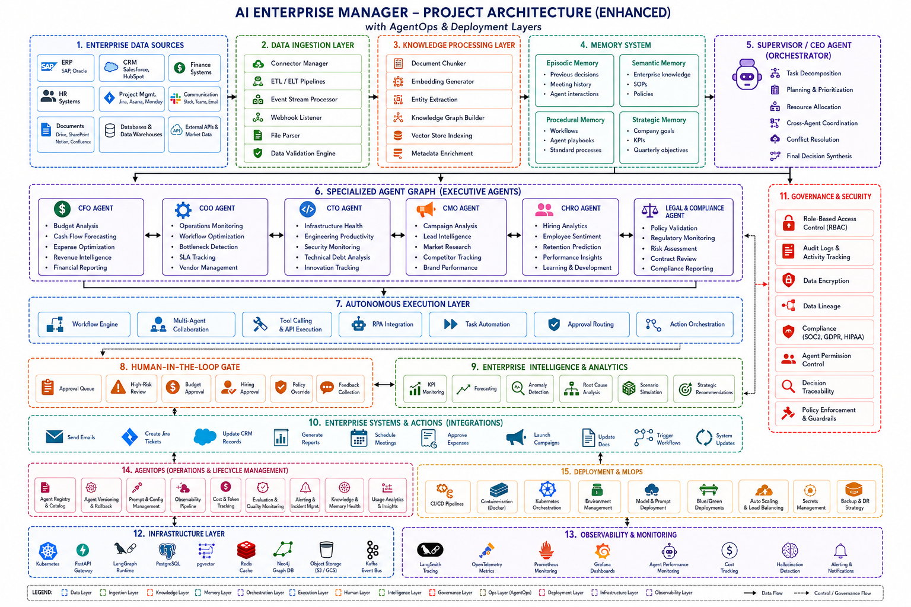

<div align="center">
  
  
  
  
  
  
  
</div>

<br>

<h1 align="center">Autonomous Enterprise Manager (AEM)</h1>

<p align="center">
  <strong>An advanced, scalable, and intelligent multi-agent orchestration platform designed to automate enterprise workflows, facilitate dynamic AI collaboration, and seamlessly integrate with internal infrastructure.</strong>
</p>

---

## 📖 Overview

The **Autonomous Enterprise Manager (AEM)** is a state-of-the-art intelligent system built to handle complex, multi-step enterprise operations. Powered by cutting-edge LLMs (Gemini/OpenAI) and orchestrated using LangGraph, AEM functions as a digital workforce capable of breaking down high-level objectives, spawning specialized agents, and collaborating dynamically to resolve complex tasks.

Designed for production environments, AEM ships with enterprise-grade security, comprehensive observability, and highly resilient fault-tolerant infrastructure out of the box.

<div align="center">
  
</div>

---

## 🎯 What is AEM? (The Product)

AEM acts as an intelligent, autonomous operating system for your engineering and product teams. Instead of manually clicking through dashboards or writing repetitive glue code, users converse with AEM to automate entire workflows. 

**Core Product Use-Cases:**
1. **Automated Code Review & Triage**: Connect AEM to your GitHub repository. It will proactively read Pull Requests, understand the context of your codebase using its semantic vector memory, and leave intelligent, actionable code reviews or flag security vulnerabilities.
2. **Intelligent Internal Documentation (RAG)**: Upload company wikis, API documentation, or architecture PDFs. AEM ingests these into its vector database, allowing any team member to ask complex architectural questions and get instant, cited answers based purely on your proprietary data.
3. **Autonomous SRE & DevOps Troubleshooting**: Ask AEM to "Check why the backend is failing". It can autonomously query logs, check system health metrics, and propose resolutions, acting as a Level-1 Site Reliability Engineer.
4. **Dynamic AI Collaboration**: Give AEM a high-level goal like "Draft a system architecture for a new microservice." The supervisor agent will automatically spawn a "Research Agent" and an "Architecture Agent" to collaborate, debate, and produce the final markdown artifact without human hand-holding.

---

## ⚙️ Under the Hood (The Technicalities)

AEM is not a simple wrapper around an LLM; it is a complex, stateful multi-agent system.

- **LangGraph State Machine**: AEM's core engine uses a directed graph (LangGraph) to manage agent states. The "Supervisor" node decides which specialized worker node (e.g., GitHub Agent, Memory Agent, Search Agent) should act next. It maintains a continuous cyclic loop until the user's objective is met.
- **Semantic Memory Architecture**: We use **Qdrant** as our high-performance vector database. When documents are uploaded, AEM chunks the text, generates high-dimensional embeddings using `SentenceTransformers`, and stores them. When a user asks a question, AEM performs a cosine-similarity vector search to inject relevant context into the LLM's prompt.
- **Asynchronous & Fault-Tolerant API**: The entire backend is built on **FastAPI** using `asyncio` to handle hundreds of concurrent agent executions. **Redis** is utilized for rapid state caching and distributed rate-limiting.
- **Strict Role-Based Security**: All endpoints are secured by a custom JWT-based authentication middleware. Users are assigned strict Roles and Permissions, ensuring that Agents cannot execute destructive actions (like merging code) without explicit authorization.

## ✨ Key Features

- 🤖 **Dynamic Multi-Agent Orchestration**: Utilizes a supervisor-worker architecture (via LangGraph) to intelligently route tasks, spawn specialized agents on-demand, and aggregate results.
- 🧠 **Persistent Context & Memory**: Implements advanced RAG (Retrieval-Augmented Generation) utilizing **Qdrant** for vector search and long-term conversation memory.
- ⚙️ **Workflow Automation**: Define, schedule, and execute complex workflows consisting of sequential or parallel AI tasks.
- 🔐 **Enterprise Security**: Comprehensive Role-Based Access Control (RBAC), API rate-limiting, JWT authentication, and full audit logging.
- 🔌 **Seamless Integrations**: Native integration with GitHub (PR reviews, issue tracking), Slack/Discord (communications), and extensible tool plugins.
- 📊 **Robust Observability**: Built-in OpenTelemetry tracing, Prometheus metrics, and Chaos Engineering frameworks to guarantee system resiliency.
- 💻 **Interactive UI**: A beautiful, real-time Streamlit dashboard for monitoring agents, managing workflows, and chatting with the AI.

---

## 🏗️ Architecture Stack

AEM is built as a robust monorepo, separating concerns between the intelligent backend engine and the user-facing dashboard.

| Component | Technology | Description |
|-----------|------------|-------------|
| **Backend** | `FastAPI`, `LangGraph`, `uvicorn` | High-performance async API for agent execution and state management. |
| **Frontend** | `Streamlit`, `Altair` | Interactive dashboards and real-time chat UI. |
| **Database** | `PostgreSQL`, `SQLAlchemy`, `Alembic` | Relational storage for users, workflows, audit logs, and RBAC policies. |
| **Vector DB** | `Qdrant` | Highly efficient vector database for RAG, memory, and semantic search. |
| **Caching/Queues** | `Redis` | Session storage, rate limiting, and distributed locking. |
| **Deployment** | `Docker Compose`, `Nginx` | Containerized production environment with automated Nginx reverse proxying. |
| **CI/CD** | `GitHub Actions` | Fully automated CI/CD pipeline enforcing code quality, testing, and zero-downtime EC2 rollouts. |

---

## 🚀 Quickstart (Local Development)

### Prerequisites
- [Docker](https://docs.docker.com/get-docker/) & Docker Compose
- [Python 3.11+](https://www.python.org/downloads/)
- [uv (Astral)](https://github.com/astral-sh/uv) - Fast Python package installer

### 1. Clone the Repository
```bash
git clone https://github.com/vaibhavdubey06/autonomous-enterprise-manager.git
cd autonomous-enterprise-manager
```

### 2. Configure Environment Variables
Create a `.env` file in the `apps/backend/` directory:
```bash
cp apps/backend/.env.example apps/backend/.env
```
Edit the `.env` file to include your LLM API keys:
```env
GEMINI_API_KEY="your_google_gemini_key"
OPENAI_API_KEY="your_openai_api_key" # Optional fallback
GITHUB_TOKEN="your_github_pat"
```

### 3. Start the Platform
You can boot the entire stack locally using Docker Compose:
```bash
docker compose -f docker-compose.yml up -d --build
```
> **Note:** The local `docker-compose.yml` mounts your local source code as volumes to enable hot-reloading.

### 4. Access the Applications
- **Frontend Dashboard:** [http://localhost:8501](http://localhost:8501)
- **Backend API Docs (Swagger):** [http://localhost:8000/docs](http://localhost:8000/docs)

---

## 🌍 Production Deployment

The AEM platform is fully configured for automated deployment to AWS EC2 using GitHub Actions.

### Deployment Workflow
1. **Push to `main`**: Triggers the `Deploy` workflow.
2. **CI Pipeline**: Runs Ruff (linting), Black (formatting), MyPy (type checking), and Pytest (unit/integration tests).
3. **Artifact Generation**: Compresses the repository into a release archive.
4. **EC2 Rollout**: Authenticates via SSH, transfers the release, applies Alembic database migrations, and triggers a zero-downtime `docker compose up -d --build` recreation using a symlink-based release strategy.

### Required GitHub Secrets
To enable automated deployments, configure the following secrets in your repository settings:
- `EC2_HOST`: The IP address of your EC2 instance.
- `EC2_USER`: The SSH username (e.g., `ubuntu`).
- `EC2_SSH_KEY`: Your private `.pem` key used to authenticate with the EC2 instance.

---

## 🧪 Testing and Quality Assurance

AEM enforces strict engineering standards through automated testing and formatting.

**Run Unit & Integration Tests:**
```bash
cd apps/backend
uv run pytest
```

**Run Code Linters & Formatters:**
```bash
uvx ruff check apps/backend apps/frontend
uvx black --check apps/backend apps/frontend
```

**Run Chaos Engineering Tests (Simulate Faults):**
```bash
cd apps/backend
uv run pytest tests/chaos/test_chaos.py
```

---

## 📁 Repository Structure

```text
autonomous-enterprise-manager/
├── apps/
│   ├── backend/               # FastAPI Application & LangGraph Agents
│   │   ├── app/
│   │   │   ├── api/           # REST API Endpoints
│   │   │   ├── core/          # App config, database setup, dependencies
│   │   │   ├── models/        # SQLAlchemy ORM Models
│   │   │   ├── security/      # RBAC, Rate Limiting, Audit Logging
│   │   │   ├── services/      # RAG, Integrations, LLM wrappers
│   │   │   └── workflows/     # LangGraph agent orchestration logic
│   │   ├── tests/             # Pytest suite (Unit, Integration, Chaos)
│   │   └── alembic/           # Database migration scripts
│   └── frontend/              # Streamlit User Interface
│       ├── app.py             # Main Entrypoint
│       └── pages/             # Streamlit Multipage UI
├── deployment/
│   ├── aws/                   # EC2 Provisioning and Deployment Scripts
│   └── nginx/                 # Production Nginx Configuration
├── .github/
│   └── workflows/             # CI/CD Pipelines
└── docker-compose.*           # Docker Orchestration Files
```

---

## 🤝 Contributing

Contributions are welcome! Please read the `CONTRIBUTING.md` file for details on our code of conduct, and the process for submitting pull requests.

### Development Workflow
1. Create a feature branch (`git checkout -b feature/amazing-feature`)
2. Commit your changes (`git commit -m 'feat: add amazing feature'`)
3. Push to the branch (`git push origin feature/amazing-feature`)
4. Open a Pull Request

---

## 📜 License

This project is licensed under the MIT License - see the [LICENSE](LICENSE) file for details.

---
<div align="center">
  <i>Built with ⚙️ for the future of Enterprise AI.</i>
</div>
