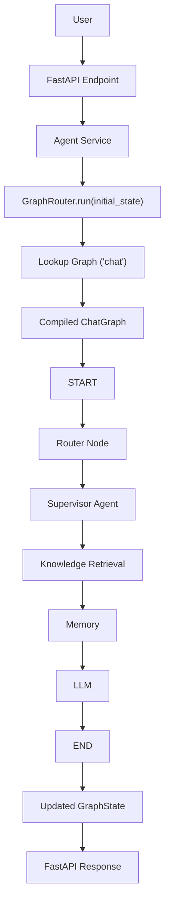

# Supervisor Agent

The CEO Agent. Decomposes tasks into sub-tasks using an LLM Planner and routes them dynamically using AgentRegistry.

## Execution Flow

```mermaid
flowchart TD
    User --> FastAPI["FastAPI Endpoint"]
    FastAPI --> AgentService["Agent Service"]
    AgentService --> GraphRouter["GraphRouter.run(initial_state)"]
    GraphRouter --> LookupGraph["Lookup Graph ('chat')"]
    LookupGraph --> CompiledChatGraph["Compiled ChatGraph"]
    CompiledChatGraph --> START["START"]
    START --> RouterNode["Router Node"]
    RouterNode --> SupervisorAgent["Supervisor Agent"]
    SupervisorAgent --> KnowledgeRetrieval["Knowledge Retrieval"]
    KnowledgeRetrieval --> Memory["Memory"]
    Memory --> LLM["LLM"]
    LLM --> END["END"]
    END --> UpdatedGraphState["Updated GraphState"]
    UpdatedGraphState --> FastAPIResponse["FastAPI Response"]
```