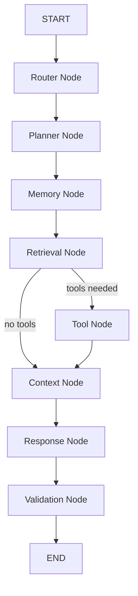

# Walkthrough — LangGraph Orchestration Layer

The Autonomous Enterprise Manager now features a production-grade **LangGraph orchestration layer** that sits on top of every existing service. Graph nodes contain zero business logic — they purely orchestrate `MemoryService`, `LLMService`, `CrossEncoderService`, and the `ToolRegistry`.

## Architecture Diagram



## Files Created (22 total)

### Core Framework
| File | Purpose |
|------|---------|
| [state.py](file:///c:/Users/dubey/autonomous-enterprise-manager/apps/backend/app/graph/state.py) | Strongly-typed `GraphState` TypedDict — the data contract between all nodes |
| [dependencies.py](file:///c:/Users/dubey/autonomous-enterprise-manager/apps/backend/app/graph/dependencies.py) | `ServiceContainer` dataclass for dependency injection |
| [registry.py](file:///c:/Users/dubey/autonomous-enterprise-manager/apps/backend/app/graph/registry.py) | `BaseTool` ABC + `ToolRegistry` + `GitHubTool` |
| [context_builder.py](file:///c:/Users/dubey/autonomous-enterprise-manager/apps/backend/app/graph/context_builder.py) | Centralised context merger (memory + enterprise + tools) |
| [builder.py](file:///c:/Users/dubey/autonomous-enterprise-manager/apps/backend/app/graph/builder.py) | Top-level factory wiring services → registry → router |
| [router.py](file:///c:/Users/dubey/autonomous-enterprise-manager/apps/backend/app/graph/router.py) | `GraphRouter` that selects and runs compiled graphs |

### Graph Nodes (8 nodes)
| Node | What it calls | What it writes to state |
|------|--------------|------------------------|
| [router_node.py](file:///c:/Users/dubey/autonomous-enterprise-manager/apps/backend/app/graph/nodes/router_node.py) | Nothing | `user_intent`, `workflow_type` |
| [planner_node.py](file:///c:/Users/dubey/autonomous-enterprise-manager/apps/backend/app/graph/nodes/planner_node.py) | Nothing (pure heuristics) | `plan`, `selected_tools` |
| [memory_node.py](file:///c:/Users/dubey/autonomous-enterprise-manager/apps/backend/app/graph/nodes/memory_node.py) | `MemoryService` | `session_id`, `conversation_id`, `recent_memory`, `semantic_memory`, `memory_context` |
| [retrieval_node.py](file:///c:/Users/dubey/autonomous-enterprise-manager/apps/backend/app/graph/nodes/retrieval_node.py) | `qdrant_service.search()`, `CrossEncoderService` | `enterprise_context`, `reranked_chunks` |
| [tool_node.py](file:///c:/Users/dubey/autonomous-enterprise-manager/apps/backend/app/graph/nodes/tool_node.py) | `ToolRegistry` | `tool_results` |
| [context_node.py](file:///c:/Users/dubey/autonomous-enterprise-manager/apps/backend/app/graph/nodes/context_node.py) | `context_builder` | `merged_context`, `context_texts`, `sources` |
| [response_node.py](file:///c:/Users/dubey/autonomous-enterprise-manager/apps/backend/app/graph/nodes/response_node.py) | `LLMService`, `MemoryService` | `answer`, `confidence` |
| [validation_node.py](file:///c:/Users/dubey/autonomous-enterprise-manager/apps/backend/app/graph/nodes/validation_node.py) | Nothing | `requires_human`, final `metrics.total_ms` |

### Compiled Graphs
| Graph | Status |
|-------|--------|
| [chat_graph.py](file:///c:/Users/dubey/autonomous-enterprise-manager/apps/backend/app/graph/graphs/chat_graph.py) | ✅ Fully implemented |
| [research_graph.py](file:///c:/Users/dubey/autonomous-enterprise-manager/apps/backend/app/graph/graphs/research_graph.py) | 🔲 Stub |
| [workflow_graph.py](file:///c:/Users/dubey/autonomous-enterprise-manager/apps/backend/app/graph/graphs/workflow_graph.py) | 🔲 Stub |
| [planning_graph.py](file:///c:/Users/dubey/autonomous-enterprise-manager/apps/backend/app/graph/graphs/planning_graph.py) | 🔲 Stub |

### API Layer
| File | Purpose |
|------|---------|
| [agent.py (schema)](file:///c:/Users/dubey/autonomous-enterprise-manager/apps/backend/app/schemas/agent.py) | `AgentChatRequest` / `AgentChatResponse` |
| [agent.py (api)](file:///c:/Users/dubey/autonomous-enterprise-manager/apps/backend/app/api/v1/agent.py) | `POST /agent/chat` endpoint |

## Key Design Decisions

1. **Deterministic Planner** — The Planner uses keyword heuristics, not LLM calls. This keeps it fast (~0ms), inspectable, and predictable.

2. **Closure-based DI** — Nodes that need services use a `make_*_node(services)` factory pattern. The factory returns a closure that LangGraph calls as a regular function. No global state.

3. **Tool Registry** — New tools (Slack, Notion, Gmail, etc.) are added by subclassing `BaseTool` and calling `registry.register()`. Zero graph changes required.

4. **Conditional Edges** — After Retrieval, the graph checks `state["selected_tools"]`. If empty, it skips the Tool Node entirely and jumps straight to Context.

5. **Existing `/chat` preserved** — The old `ChatService`-based endpoint is untouched. The new `POST /agent/chat` runs through LangGraph.

## Observability

Every node appends to `execution_trace`:
```json
{
    "node": "Memory",
    "start_time": "2026-06-26T10:20:00Z",
    "end_time": "2026-06-26T10:20:00.050Z",
    "duration_ms": 50.12,
    "status": "success"
}
```

The `metrics` dict aggregates per-node timings plus `total_ms`.

## Extending the System

To add a new agent (e.g., Research Agent):
1. Create `app/graph/graphs/research_graph.py`
2. Add new nodes if needed in `app/graph/nodes/`
3. Register in `GraphRouter.__init__`
4. Done — no existing code changes
